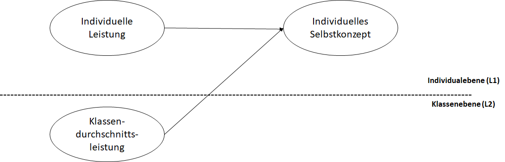
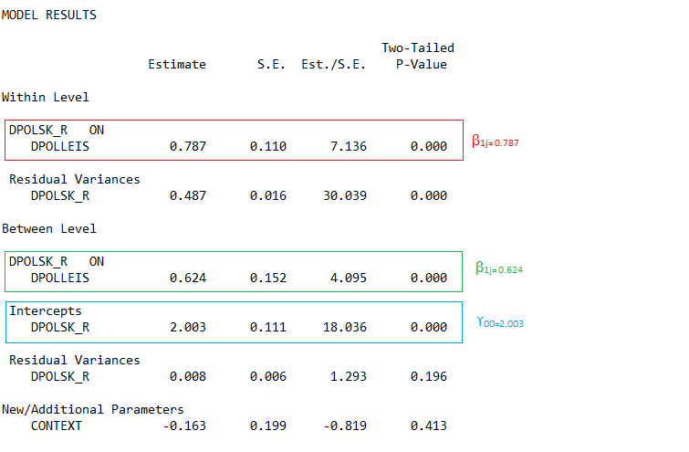

```{r setup, include=FALSE}
knitr::opts_chunk$set(echo = TRUE)
```

# Purpose
This document is to document models for a big-fish-pond effect **(BFLPE)**.

## Model 1: Random-Intercept Model (Figure 1)
The individual level (Level 1): individual reading performance to predict individual self-concept.
The class level (Level 2): individual the average of reading performance to predict self-concept.

```{r fig_path,echo=FALSE,fig.cap="Reading perfromance to self concept",out.width='90%',fig.align='center'}

```

### Model 1 can be expressed mathematically:

+ $i$ represents an individual,$j$ represents a class, $IndSk_{ij}$ is individual self-concept, $IndLeis_{ij}$ is individual reading performance,$KLeis_{j}$ is the average of reading performance in class. $\gamma_{ij}$ is a random effect at the individual level.
+ $\beta_{0j}$ is a random effect and each school has own intercept. $\gamma_{00}$ is a grand mean.
$\upsilon_{0j}$ is a random effect at the class level.
+ $\beta_{1j}$ is a slope for the predictor of $IndSk_{ij}$. It is a fixed effect and there is only one slope across classes.


*Individual level (L1)*
$$IndSk_{ij}=\beta_{0j}+\beta_{1j}*IndLeis_{ij}+\gamma_{ij}, \gamma_{ij}\sim {\sf Norm}(0, \sigma_{\gamma}^2) $$ 

*Class level (L2)*
 $$\beta_{0j}=\gamma_{00}+\gamma_{01}*KLeis_{j}+\upsilon _{0j}, \upsilon_{0j}\sim{\sf Norm}(0,\sigma_{\gamma}^2)$$ 

$$\beta_{1j}=\gamma_{10}$$ 

### Model1 Mplus code:
USEVAR =  	dPolSk_r
                  dPolLeis;
    MISSING = all(-9999);		
    CLUSTER = klasid;
  	
  ANALYSIS:	TYPE = TWOLEVEL;

  DEFINE:  	center (groupmean);	

  MODEL:
  
    %WITHIN%
  dPolSk_r ON dPolLeis(b_within);	

    %BETWEEN%
  dPolSk_r ON dPolLeis (b_between);#Mplus automatically

  MODEL CONSTRAINT:
  !Define and estimate the composition effect
  new(context);
  context  = b_between - b_within;

**Note**. Mplus automatically calculated the average of reading performance for each class because
you did not make a claim in the USEVAR.

### Mplus output:
```{r fig_output, echo=FALSE,fig.cap="Model Result from Mplus", out.width='90%',fig.align='center'}


```


